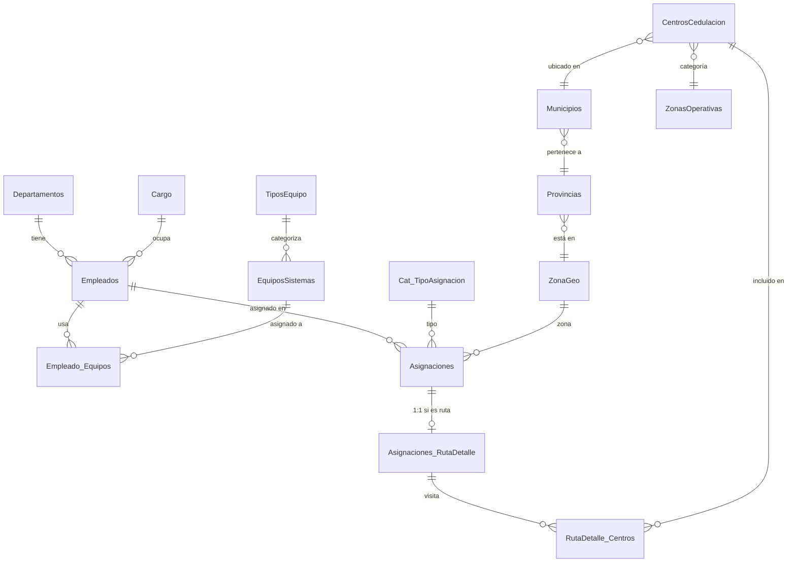
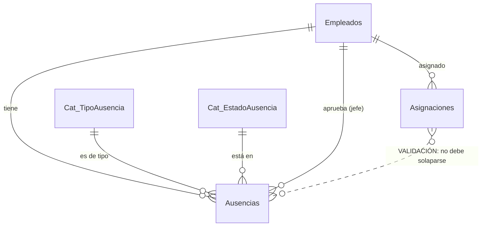

# SCA — Auditoría y Plan de Reestructuración

> Documento de referencia para entender qué tiene hoy el proyecto, qué problemas arrastra y por dónde reorganizarlo antes de meterle Gestión Humana.
>
> Stack: **Angular 18 (frontend) + Node.js/Express + TypeScript (backend) + SQL Server**.

---

## 1. Mapa actual del Frontend (Angular 18)

```
SCA/
└── src/app/
    ├── app.routes.ts          ← rutas: home, asignaciones, disponibilidad, mantenimientos
    ├── app.config.ts
    ├── layout/                ← header, sidebar, footer (Bootstrap)
    ├── components/
    │   └── breadcrumb/        ← reutilizable
    ├── pages/
    │   ├── home/                       ← dashboard con resúmenes
    │   ├── asignaciones-semanal/       ← grilla semanal (lo más complejo, 919 líneas)
    │   ├── disponibilidad/             ← lista con bloqueos manuales
    │   ├── levantamiento/              ← VACÍO (sólo cascarón)
    │   └── mantenimientos/
    │       ├── mantenimientos/         ← menú/portada de mantenimientos
    │       └── empleados/              ← CRUD de empleados
    ├── services/
    │   ├── empleados.service.ts        ← ⚠ HACE DEMASIADO (17 métodos)
    │   ├── disponibilidad.service.ts   ← ⚠ sólo en memoria, no persiste
    │   └── logistica.service.ts        ← ⚠ sólo en memoria, no persiste
    └── interfaces/
        └── asignacion.interface.ts     ← ⚠ 9 interfaces mezcladas
```

### Pantallas que ya tienes funcionando

| Pantalla | Ruta | Qué hace |
|---|---|---|
| Inicio | `/home` | Dashboard con totales por tipo de asignación |
| Asignaciones Semanales | `/asignaciones` | Grilla semana × empleado para asignar Sede / Metro / Interior / Exterior |
| Disponibilidad | `/disponibilidad` | Lista de empleados con bloqueo manual (no persiste) |
| Mantenimientos | `/mantenimientos` | Menú |
| Empleados | `/mantenimientos/empleados` | CRUD de empleados con equipos asignados |
| Levantamiento | `/levantamiento` | Pantalla vacía |

---

## 2. Mapa actual de la Base de Datos (SQL Server)



### Tablas detectadas

**Catálogos:**
- `Departamentos` — IdDepartamento, descripcion
- `Cargo` — IdCargo, descripcion
- `Cat_TipoAsignacion` — IdTipo, nombre → **1=Sede, 2=Metro, 3=Interior, 4=Exterior**
- `ZonaGeo` — IdZonaGeo, Descripcion → Norte / Sur / Este
- `TiposEquipo`, `EquiposSistemas`
- `Provincias`, `Municipios`, `ZonasOperativas`, `CentrosCedulacion`

**Entidades operativas:**
- `Empleados` — id, nombre, codigo, cedula, teléfonos, IdDepartamento, IdCargo, ubicacion, localidad, **estado (bool: activo/inactivo)**
- `Asignaciones` — IdAsignacion, IdEmpleado, IdTipo, Fecha, CantidadAsignaciones, DiasViaje, IdZonaGeo, **idEstado (1=Ocupado, 3=Disponible)**
- `Asignaciones_RutaDetalle` — detalle 1:1 cuando la asignación es Metro/Interior/Exterior (fechas, ticket, chofer, placa)
- `RutaDetalle_Centros` — N:N de centros visitados con orden

**Relaciones N:N:**
- `Empleado_Equipos` — equipos asignados a cada técnico

---

## 3. Problemas que arrastras (en orden de prioridad)

### 🔴 Críticos (te están haciendo perder la cabeza)

1. **`empleados.service.ts` se convirtió en un "Dios"**
   Tiene 17 métodos: empleados + asignaciones + zonas + centros + tipos + departamentos + cargos. Cuando algo falla no sabes dónde mirar.

2. **`asignacion.interface.ts` mezcla 9 interfaces** de dominios distintos (Empleado, Asignacion, Centro, Zona, etc.). Cualquier cambio toca el mismo archivo.

3. **`asignaciones-semanal.component.ts` tiene 919 líneas**: navegación de semanas, carga de empleados, cálculo de stats, validaciones, alertas, filtros, formularios, guardado. Es imposible de mantener.

4. **Magic numbers regados**: `idTipo === 1`, `idEstado !== 3`, `[2, 3, 4].includes(...)`. Si mañana cambia un id, hay que buscar manualmente.

### 🟠 Importantes (te van a doler al crecer)

5. **`logistica.service.ts` y `disponibilidad.service.ts` no persisten**: guardan en memoria y se pierde todo al recargar. Hoy no se usan en serio — están "muertos" pero confunden.

6. **No existe el concepto de "ausencia" en BD**. Lo que hoy llamas "disponibilidad" se infiere mirando si hay asignaciones activas, lo cual es frágil. **Esto es justo lo que necesita cambiar para Gestión Humana.**

7. **El nombre `idEstado` está sobrecargado**: a veces es estado de la asignación, otras veces se confunde con estado del empleado. Hay que separarlo.

### 🟡 Menores (limpieza cuando puedas)

8. La pantalla de `levantamiento` está vacía pero ocupada en rutas y sidebar.
9. El `sidebar` apunta a `/registrar-trabajo` que no existe en `app.routes.ts`.
10. Empleados tiene mucho comentario antiguo (las 100 filas comentadas en `disponibilidad.component.ts`).

---

## 4. Reestructuración propuesta — manteniéndolo SIMPLE

> Regla de oro: **una carpeta por dominio**. Si estás trabajando en algo de Empleados, todo lo que necesitas vive en `features/empleados/`.

### 4.1 Frontend Angular — estructura objetivo

```
src/app/
├── core/                          ← lo que se carga UNA vez
│   ├── constants/
│   │   ├── tipo-asignacion.ts     ← TIPO.SEDE = 1, TIPO.METRO = 2…
│   │   └── estado-asignacion.ts   ← ESTADO.OCUPADO = 1, DISPONIBLE = 3
│   ├── interceptors/              ← (luego) auth, errores
│   └── services/
│       └── api.service.ts         ← wrapper de HttpClient si quieres
│
├── shared/                        ← lo que se reutiliza en varias pantallas
│   ├── components/
│   │   └── breadcrumb/
│   └── pipes/
│
├── layout/                        ← (igual que ahora)
│
├── features/                      ← UN MÓDULO POR DOMINIO
│   ├── home/
│   │   ├── home.component.ts
│   │   └── home.component.html
│   │
│   ├── empleados/
│   │   ├── pages/empleados/       ← CRUD
│   │   ├── services/empleados.service.ts
│   │   └── interfaces/empleado.interface.ts
│   │
│   ├── catalogos/                 ← departamentos, cargos, equipos, zonas, centros
│   │   ├── services/catalogos.service.ts
│   │   └── interfaces/
│   │
│   ├── asignaciones/
│   │   ├── pages/
│   │   │   └── asignaciones-semanal/
│   │   ├── components/            ← partir el componente gigante
│   │   │   ├── celda-dia/
│   │   │   ├── fila-empleado/
│   │   │   └── resumen-semanal/
│   │   ├── services/
│   │   │   └── asignaciones.service.ts
│   │   └── interfaces/
│   │       ├── asignacion.interface.ts
│   │       └── ruta-centro.interface.ts
│   │
│   └── gestion-humana/            ← ★ NUEVO MÓDULO
│       ├── pages/
│       │   ├── ausencias/         ← lista y CRUD
│       │   └── calendario/        ← calendario de quién está fuera
│       ├── services/
│       │   └── ausencias.service.ts
│       └── interfaces/
│           └── ausencia.interface.ts
│
└── app.routes.ts                  ← apunta a cada feature con lazy loading
```

### 4.2 Backend Express — estructura objetivo

Tu backend **ya está organizado decentemente**. Sólo hay que añadir el módulo de Gestión Humana siguiendo el mismo patrón:

```
server/src/
├── controllers/
│   ├── empleados.controller.ts
│   ├── asignaciones.controller.ts
│   └── ausencias.controller.ts        ← ★ NUEVO
├── routes/
│   ├── empleados.routes.ts
│   ├── asignaciones.routes.ts
│   └── ausencias.routes.ts            ← ★ NUEVO
├── db/
│   └── queriesSCA/
│       ├── queriesSCA.ts              ← partir en archivos por dominio
│       ├── queries.empleados.ts       ← (sugerido)
│       ├── queries.asignaciones.ts    ← (sugerido)
│       └── queries.ausencias.ts       ← ★ NUEVO
└── middlewares/
    └── validar-disponibilidad.ts      ← ★ NUEVO (verifica antes de asignar)
```

---

## 5. Módulo nuevo: Gestión Humana

### 5.1 Tablas SQL Server a crear

```sql
-- Catálogo: tipos de ausencia
CREATE TABLE Cat_TipoAusencia (
    IdTipoAusencia  INT IDENTITY(1,1) PRIMARY KEY,
    Descripcion     NVARCHAR(50) NOT NULL,
    AfectaAsignacion BIT NOT NULL DEFAULT 1   -- 1 = bloquea, 0 = informativo
);
-- Datos iniciales: Vacaciones, Permiso, Licencia Médica, Capacitación, Baja

-- Catálogo: estados de la solicitud
CREATE TABLE Cat_EstadoAusencia (
    IdEstadoAusencia INT IDENTITY(1,1) PRIMARY KEY,
    Descripcion      NVARCHAR(30) NOT NULL
);
-- Datos: Pendiente, Aprobada, Rechazada, En Curso, Finalizada, Cancelada

-- Tabla principal
CREATE TABLE Ausencias (
    IdAusencia      INT IDENTITY(1,1) PRIMARY KEY,
    IdEmpleado      INT NOT NULL,
    IdTipoAusencia  INT NOT NULL,
    IdEstadoAusencia INT NOT NULL DEFAULT 1,
    FechaInicio     DATE NOT NULL,
    FechaFin        DATE NOT NULL,
    DiasSolicitados INT NOT NULL,
    Motivo          NVARCHAR(500) NULL,
    FechaSolicitud  DATETIME NOT NULL DEFAULT GETDATE(),
    FechaAprobacion DATETIME NULL,
    AprobadoPor     INT NULL,
    Comentarios     NVARCHAR(500) NULL,
    CONSTRAINT FK_Ausencias_Empleado    FOREIGN KEY (IdEmpleado)    REFERENCES Empleados(id),
    CONSTRAINT FK_Ausencias_Tipo        FOREIGN KEY (IdTipoAusencia) REFERENCES Cat_TipoAusencia(IdTipoAusencia),
    CONSTRAINT FK_Ausencias_Estado      FOREIGN KEY (IdEstadoAusencia) REFERENCES Cat_EstadoAusencia(IdEstadoAusencia),
    CONSTRAINT FK_Ausencias_AprobadoPor FOREIGN KEY (AprobadoPor)   REFERENCES Empleados(id),
    CONSTRAINT CK_Ausencias_Fechas      CHECK (FechaFin >= FechaInicio)
);

-- Índice para consultar rápido si un empleado está ausente en una fecha
CREATE INDEX IX_Ausencias_Empleado_Fechas
ON Ausencias (IdEmpleado, FechaInicio, FechaFin, IdEstadoAusencia);
```

### 5.2 Vista útil para el frontend

```sql
CREATE VIEW vw_EmpleadosDisponiblesHoy AS
SELECT e.id, e.nombre, e.codigo
FROM Empleados e
WHERE e.estado = 1
  AND NOT EXISTS (
    SELECT 1 FROM Ausencias a
    WHERE a.IdEmpleado = e.id
      AND a.IdEstadoAusencia IN (2, 4)   -- Aprobada o EnCurso
      AND CAST(GETDATE() AS DATE) BETWEEN a.FechaInicio AND a.FechaFin
  );
```

### 5.3 Reglas de negocio (donde se aplican)

| Regla | Dónde se valida | Cómo |
|---|---|---|
| No permitir asignar a empleado en vacaciones | Backend (`asignaciones.controller`) antes del INSERT | Query a `Ausencias` con la fecha que quiere asignar |
| Mostrar al empleado como "Disponible" el día que regresa | Frontend automático | La vista `vw_EmpleadosDisponiblesHoy` se recalcula sola cada día |
| Advertencia si el empleado tiene muchas rutas | Frontend en `agregarAsignacion()` | Si el contador semanal supera N, mostrar SweetAlert |
| Bloquear toda la grilla en días ausentes | Frontend en `getClaseColor()` | Aplicar clase `bg-ausencia` a las celdas dentro del rango |

### 5.4 Relación con lo existente



---

## 6. Plan de migración paso a paso

> **Importante**: NO refactorices todo a la vez. Cada paso debe quedar funcionando antes del siguiente.

### Fase 1 — Limpieza sin romper nada (1-2 días)
1. Crear `core/constants/` con las constantes de tipos y estados.
2. Reemplazar los magic numbers en los componentes (uno por uno).
3. Borrar los servicios `logistica.service.ts` y `disponibilidad.service.ts` (ya no se usan persistentemente).
4. Borrar la pantalla `levantamiento` o decidir qué será.
5. Arreglar el link `/registrar-trabajo` del sidebar.

### Fase 2 — Separar interfaces y servicios (1 día)
1. Partir `asignacion.interface.ts` en archivos por dominio.
2. Sacar de `empleados.service.ts` los métodos que NO son de empleados → mover a `asignaciones.service.ts` y `catalogos.service.ts`.

### Fase 3 — Reestructurar carpetas a `features/` (medio día por feature)
1. Mover `empleados/` a `features/empleados/`.
2. Mover `asignaciones-semanal/` a `features/asignaciones/pages/`.
3. Actualizar imports y rutas.

### Fase 4 — Crear el módulo Gestión Humana (1-2 días)
1. **BD**: Ejecutar el script de tablas y vista.
2. **Backend**: crear `ausencias.controller`, `ausencias.routes`, `queries.ausencias`.
3. **Frontend**: crear `features/gestion-humana/` con CRUD básico de Ausencias.
4. Probar el flujo: registrar vacaciones → ver que el empleado aparece bloqueado en la grilla.

### Fase 5 — Aplicar reglas de negocio (1 día)
1. Backend: middleware `validar-disponibilidad.ts` que se ejecuta antes de POST `/asignaciones/guardar-celda`.
2. Frontend: marcar visualmente las celdas en rango de ausencia.
3. Frontend: alerta cuando el empleado supere el límite de rutas semanales.

### Fase 6 — Partir el componente gigante (1-2 días)
- Extraer `<celda-dia>`, `<fila-empleado>`, `<resumen-semanal>` desde `asignaciones-semanal.component.ts`.
- Mover toda la lógica de cálculos a `asignaciones.service.ts`.

---

## 7. Cómo usar este documento

1. Léelo entero una vez para tener la imagen mental.
2. Cuando vayas a tocar algo, abre la sección que corresponda.
3. Marca con ✅ los pasos del Plan de migración a medida que los vayas completando.
4. Si algo no entiendes, busca por el nombre del archivo o tabla — todo está referenciado con su nombre real.

> Este documento se actualiza tras cada fase. Si una decisión cambia, edita acá primero, después el código.
